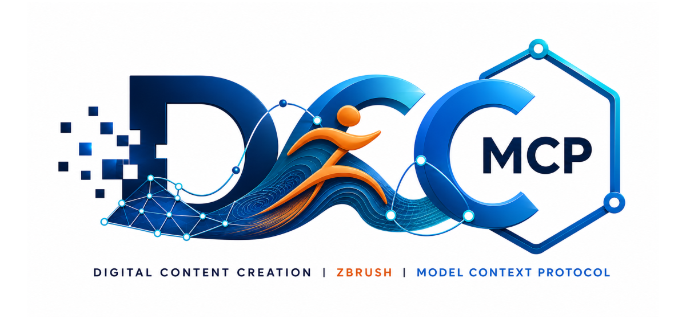
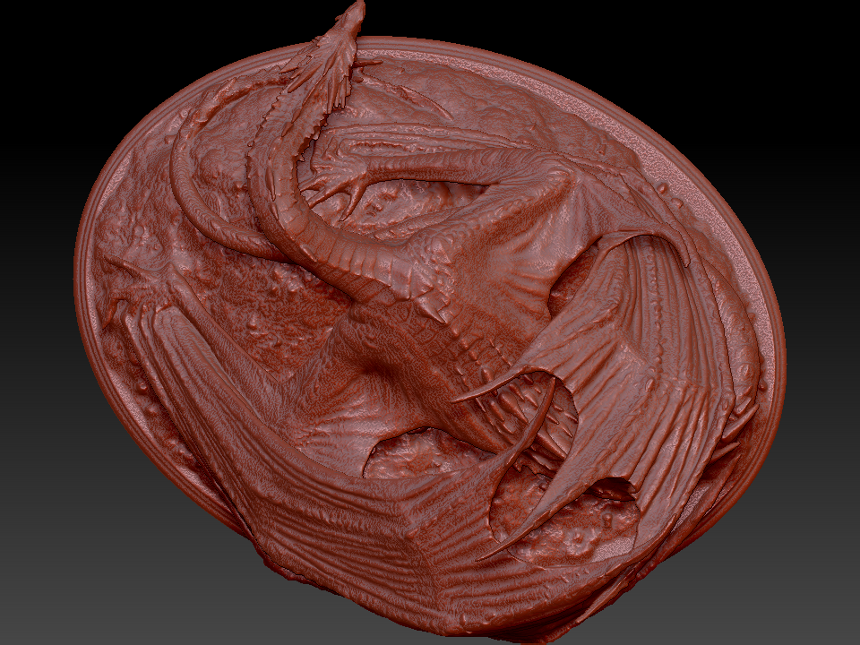

# dcc-mcp-zbrush

<p align="center">
  
</p>

## Agent workflow

AI agents should use the shared gateway through `dcc-mcp-cli`; IDE users may
continue to use the MCP endpoint. Prefer typed skills and tools over raw scripts.

### Install or update the CLI

`dcc-mcp-cli` is the preferred control path for every shell-capable agent. If
it is missing, ask the user before installing the latest official release:

```bash
# Linux/macOS
curl -fsSL https://raw.githubusercontent.com/dcc-mcp/dcc-mcp-core/main/scripts/install-cli.sh | sh

# Windows PowerShell
powershell -ExecutionPolicy Bypass -c "irm https://raw.githubusercontent.com/dcc-mcp/dcc-mcp-core/main/scripts/install-cli.ps1 | iex"
```

Keep an official build current through the release manifest:

```bash
dcc-mcp-cli update check
dcc-mcp-cli update apply
```

`update apply` downloads and stages the latest CLI for the next launch. It
does not update a running `dcc-mcp-server`; update that server in its own
environment.

```bash
dcc-mcp-cli dcc-types
dcc-mcp-cli list
dcc-mcp-cli search --query "<task>" --dcc-type zbrush
dcc-mcp-cli describe <tool-slug>
dcc-mcp-cli call <tool-slug> --json '{"key":"value"}'
```

`dcc-types` reports release-catalog support; `list` reports live sessions. If a
tool belongs to an inactive progressive skill, call `dcc-mcp-cli load-skill <skill-name> --dcc-type zbrush` before retrying. For post-task improvement,
attach a stable session id with `--meta-json`, query `dcc-mcp-cli stats --range 24h --session-id <task-id>`, then pass the bounded evidence to the
`review_skill_improvement` prompt from `dcc-mcp-skills-creator`.


[](https://pypi.org/project/dcc-mcp-zbrush/)
[](https://www.python.org/downloads/)
[](LICENSE)
[](https://github.com/dcc-mcp/dcc-mcp-zbrush)

ZBrush adapter for the [DCC Model Context Protocol](https://github.com/dcc-mcp/dcc-mcp-core) ecosystem.

> **Requires ZBrush 2026.1+** with the official [Python SDK](https://developers.maxon.net/docs/zbrush/py/2026_1_0/index.html) (CPython 3.11 embedded in ZBrush).

## Showcase



Real ZBrush 2026 evidence from a typed, quiet high-poly workflow: **2,499,970 points / 5,000,000 faces**, inspected and exported as the active Dragon subtool. Fantasy Dragon model by [Artec 3D](https://www.artec3d.com/3d-models/fantasy-dragon), used under CC BY 4.0; the source model is not included in this repository. See the [full workflow and copyable prompt](https://dcc-mcp.github.io/showcase#zbrush-fantasy-dragon).

## Quick install

### 1. Install a fixed wheel version

```bash
python -m pip install "dcc-mcp-zbrush==<version>"
```

The wheel includes the lifecycle CLI and the sidecar bridge payload.

### 2. Plan and apply the plugin install

Set `ZBRUSH_USER_ASSETS_DIR`, then run the standard lifecycle. The installer
requires an explicit ZBrush path so it can prove the 2026.1+ host floor.

```bash
dcc-mcp-zbrush install --version <version> --dcc-path "<ZBrush path>" --python python --dry-run --json
dcc-mcp-zbrush install --version <version> --dcc-path "<ZBrush path>" --python python --yes --json
```

The fixed release payload is SHA-256 verified before caching. Sidecar mode
installs a dedicated module and appends a bounded managed block to the shared
`Python/init.py`; it never overwrites that file. Receipt-backed uninstall and
rollback restore the previous state. Applying an install or upgrade stages a
candidate and returns exit `50`; the candidate is committed only after the
exact ZBrush process, start identity, endpoint, version, and loaded module
origins pass `verify`.

See the [canonical lifecycle SOP](docs/install.md) ([raw URL](https://raw.githubusercontent.com/dcc-mcp/dcc-mcp-zbrush/main/docs/install.md)).

### 3. Restart ZBrush

Launch or restart ZBrush, then start the external MCP sidecar:

```bash
dcc-mcp-zbrush --mode sidecar --socket-port 9876
```

The plugin registers a top-level **DCC MCP** palette through the official
ZBrush Python SDK with these actions:

- **Copy Instance ID**
- **Server Info**
- **About DCC MCP**

Instance identity belongs to the MCP server. In embedded mode the first two
actions read the public `DccServerBase` runtime context. The standalone
sidecar plugin does not guess identity from environment variables or registry
files; it directs you to `dcc-mcp-cli list` when that external context is not
available in the ZBrush process.

### 4. Verify host readiness

Verify the dynamically allocated instance URL:

```bash
dcc-mcp-zbrush verify --version <version> --dcc-path "<ZBrush path>" --python python --json
dcc-mcp-cli list
```

### 5. Configure your AI client

Add the MCP server to your AI client config (Cursor, Claude Desktop, etc.):

```json
{
  "mcpServers": {
    "zbrush": {
      "url": "http://127.0.0.1:9765/mcp"
    }
  }
}
```

---

## How it works

ZBrush **does not ship a built-in HTTP REST server**. The pre-alpha scaffold that assumed `Preferences > Network > Enable HTTP Server` was incorrect.

The supported integration paths are:

| Mode | When to use | Stack |
|------|-------------|-------|
| **Sidecar + socket plugin** (recommended) | Production GUI and CI clients | External Python → TCP :9876 → main-thread bridge inside ZBrush |
| **Embedded** (advanced) | Pure-Python experiments only | Python plugin inside ZBrush → `zbrush.commands` |

Rust is **not** loaded inside ZBrush. The **`dcc-mcp-core` wheel** (PyO3) runs
in the external sidecar process; importing its extension module into the ZBrush
2026 embedded VM is not a supported runtime path. The ZBrush-facing bridge is
Python only and executes requests serially on the host main thread while
pumping UI updates between requests. Only one SDK request is admitted at a
time; additional requests fail with a retryable busy response, and `ping`
remains available without touching the SDK. A long native operation can still
make Windows report ZBrush as not responding because the Maxon SDK call itself
is synchronous. If a bridge timeout says the request is still running, do not
retry the mutation; poll bridge health until `busy` becomes false. File import,
export, and baking suppress scripted action feedback without wrapping the
native operation in `zbc.freeze()`, so ZBrush can still present progress or a
required native dialog.

GoZ C++ SDK is for **mesh exchange between DCC apps**, not general MCP automation — we do not build the primary adapter on GoZ.

```
Recommended sidecar mode:

AI Agent → Gateway :9765 → OS-assigned MCP instance → ZBrushMcpServer
         → TCP :9876 → mcp_socket_bridge.py (inside ZBrush) → zbrush.commands
```

## Features (v0.2.0)

- `DccServerBase` adapter with progressive skill loading
- Bundled skills: `zbrush-scripting`, `zbrush-scene`, `zbrush-subtool`, `zbrush-brush`, `zbrush-viewport`, `zbrush-interchange`, `zbrush-import-to-scene`
- In-process executor for ZBrush's embedded Python VM
- Optional socket bridge plugin for sidecar deployments
- Top-level DCC MCP palette registered through `zbrush.commands`
- Gateway election compatible with `dcc-mcp-core`

## Requirements

- ZBrush **2026.1+**
- Python **3.10+** on the sidecar host (ZBrush itself ships 3.11)
- `dcc-mcp-core >= 0.20.14`

## Environment variables

| Variable | Default | Purpose |
|----------|---------|---------|
| `DCC_MCP_ZBRUSH_PORT` | OS-assigned | Optional fixed MCP instance port |
| `DCC_MCP_ZBRUSH_MODE` | auto | `embedded` or `sidecar` |
| `DCC_MCP_ZBRUSH_AUTOSTART` | `1` | Auto-start embedded server from plugin |
| `DCC_MCP_ZBRUSH_SOCKET_PORT` | `9876` | Socket bridge port (sidecar) |
| `DCC_MCP_GATEWAY_PORT` | `9765` | Gateway election port |
| `DCC_MCP_MINIMAL` | `1` | Progressive skill loading |

## Bundled skills

| Skill | Tools |
|-------|-------|
| `zbrush-scripting` | `execute_python`, `get_session_info` |
| `zbrush-scene` | `get_scene_info`, `list_subtools` |
| `zbrush-subtool` | `select_subtool`, `get_subtool_status` |
| `zbrush-brush` | `create_wrinkle_brush`, `load_wrinkle_brush` |
| `zbrush-viewport` | `capture_turntable` |
| `zbrush-interchange` | `export_active_subtool_obj` |

## Path concepts

- **PYTHONPATH** — where Python looks for packages (`pip install` handles this)
- **ZBRUSH_USER_ASSETS_DIR** / **ZBRUSH_PLUGIN_PATH** — plugin scan roots used by ZBrush 2026.1+

`pip install dcc-mcp-zbrush` puts the Python package on `PYTHONPATH`. The
lifecycle CLI installs host files transactionally; do not copy a bridge over
the shared `Python/init.py` manually.

## Skill authoring

Skills lazy-import `zbrush.commands` and run on the main thread (`affinity: main`).

```python
from dcc_mcp_core.skill import skill_entry
from dcc_mcp_zbrush.api import import_zbc, with_zbrush, zb_success


@skill_entry
@with_zbrush
def my_tool(**kwargs) -> dict:
    zbc = import_zbc()
    count = zbc.get_subtool_count()
    return zb_success(f"{count} subtool(s)", count=count)
```

## Sidecar mode

After completing the receipt-driven install and restarting ZBrush, run the MCP
server outside ZBrush:

The sidecar can also start first: it retains the bridge endpoint and retries
the connection on the first tool call after ZBrush becomes available.

```bash
dcc-mcp-zbrush --mode sidecar --socket-port 9876
```

## Development

See [docs/development.md](docs/development.md) for source-based setup, testing, and contribution workflow.

## References

- [ZBrush Python SDK 2026.1](https://developers.maxon.net/docs/zbrush/py/2026_1_0/index.html)
- [ZBrush Python environment](https://developers.maxon.net/docs/zbrush/py/2026_1_0/manuals/python_environment.html)
- [GoZ SDK (mesh exchange only)](https://developers.maxon.net/docs/zbrush/goz_sdk.pdf)
- Community reference: [newsbubbles/zbrush-mcp](https://github.com/newsbubbles/zbrush-mcp) (socket bridge pattern)

## License

MIT
